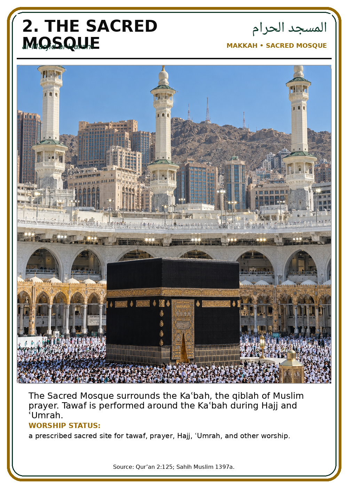
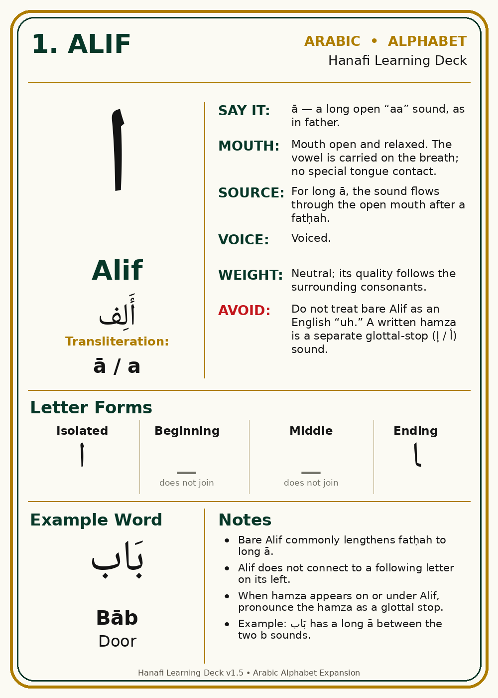
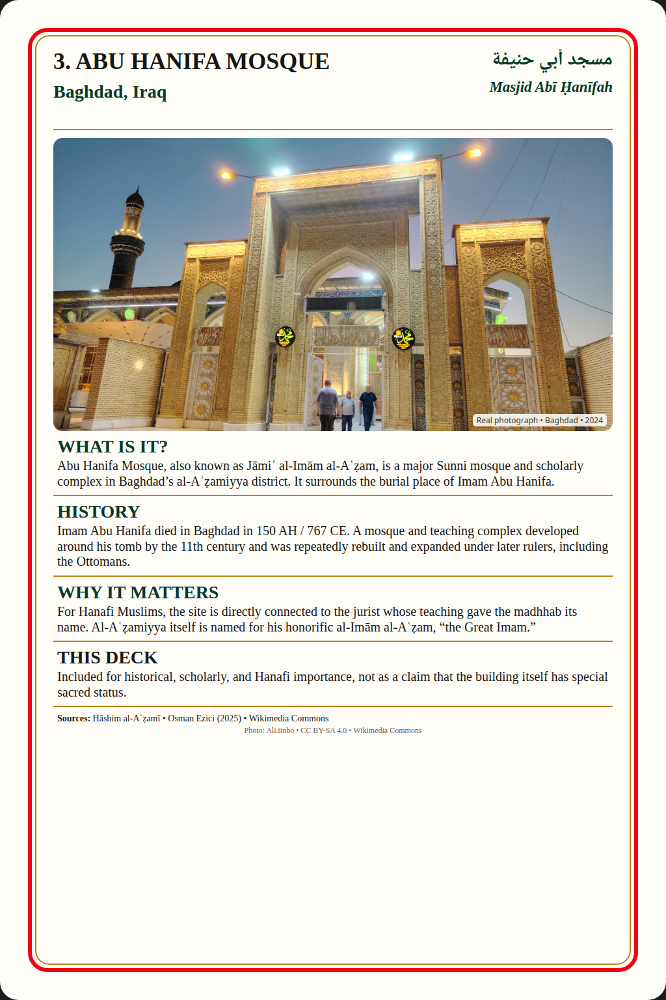

<h1 align="center">Hanafi Learning Deck v2.1</h1>

<div align="center">

<p dir="rtl"><strong>بِسْمِ اللَّهِ الرَّحْمَٰنِ الرَّحِيمِ</strong></p>
<p><strong>Bismillāhir-Raḥmānir-Raḥīm</strong></p>
<p>In the name of Allah, the Most Compassionate, the Most Merciful.</p>

<br>

<p dir="rtl"><strong>الْحَمْدُ لِلَّهِ رَبِّ الْعَالَمِينَ، وَالصَّلَاةُ وَالسَّلَامُ عَلَىٰ رَسُولِ اللَّهِ</strong></p>
<p><strong>Al-ḥamdu lillāhi Rabbil-ʿālamīn, waṣ-ṣalātu was-salāmu ʿalā Rasūlillāh.</strong></p>
<p>All praise belongs to Allah, Lord of the worlds, and peace and blessings be upon the Messenger of Allah ﷺ.</p>

<br>

<p dir="rtl"><strong>يُقَامُ هَذَا الْمَشْرُوعُ ابْتِغَاءَ مَرْضَاةِ اللَّهِ وَنَشْرِ الْعِلْمِ النَّافِعِ. نَسْأَلُ اللَّهَ أَنْ يَتَقَبَّلَ مَا فِيهِ مِنَ الصَّوَابِ وَالنَّفْعِ، وَأَنْ يَغْفِرَ مَا فِيهِ مِنَ الْخَطَإِ، وَأَنْ يَهْدِيَ إِلَى مُوَاصَلَةِ تَصْحِيحِهِ وَتَحْسِينِهِ. آمِين.</strong></p>
<p><strong>Yuqāmu hādhā al-mashrūʿu ibtighāʾa marḍāti Allāhi wa-nashri al-ʿilmi al-nāfiʿ. Nasʾalu Allāha an yataqabbala mā fīhi mina al-ṣawābi wa-al-nafʿi, wa-an yaghfira mā fīhi mina al-khaṭaʾi, wa-an yahdiya ilā muwāṣalati taṣḥīḥihi wa-taḥsīnihi. Āmīn.</strong></p>
<p>This project is undertaken seeking the pleasure of Allah and the spread of beneficial knowledge. May Allah accept what is correct and beneficial in it, forgive its errors, and guide its continued correction and improvement. <strong>Āmīn.</strong></p>

</div>

A growing, printable, offline-capable, and mobile-friendly library for learning **Islam through a consistent Hanafi framework**: belief, salah, purification, duʿā, daily worship, Qur'an, Arabic literacy, sacred places, Islamic geography, live religious media, Islamic history, jurisprudence, and the wider Muslim world.

The project began as a small personal study deck. It has grown into a connected learning system built around the same idea: useful Islamic material should be clear, traceable, practical, and easy to return to every day.

> **Current published checkpoint:** **v2.1**
>
> **v2.1 status:** **closed and accepted**
>
> **Next public version:** **not assigned**
>
> **Published card library:** **209 cards across five independent sets**
>
> **Status:** educational study aid, still undergoing full manual audit and pending qualified imam/scholar review.

## Project principle

> **No advertising. Islam is not for sale.**  
> No account, no paywall, and no behavioral tracking by the Hanafi Learning Deck. The project exists to help people learn, remember Allah ﷻ, and surround themselves with the dīn, not to turn Islam into a commodity.

## Start here

Current work is maintained on **`main`**.

- **Web App:** https://dereksparks1982.github.io/Hanafi-Islam-Learning-Deck/
- **Qur'an Reader:** https://dereksparks1982.github.io/Hanafi-Islam-Learning-Deck/quran/
- **Makkah Live & Prayer Clock:** https://dereksparks1982.github.io/Hanafi-Islam-Learning-Deck/makkah/
- **Holy Places Explorer:** https://dereksparks1982.github.io/Hanafi-Islam-Learning-Deck/explore/
- **Media:** https://dereksparks1982.github.io/Hanafi-Islam-Learning-Deck/media/
- **Live:** https://dereksparks1982.github.io/Hanafi-Islam-Learning-Deck/live/
- **v2.1 closeout:** [`docs/V2.1_CLOSEOUT.md`](docs/V2.1_CLOSEOUT.md)
- **Current handoff:** [`docs/CURRENT_HANDOFF.md`](docs/CURRENT_HANDOFF.md)
- **Company Bible:** [`docs/COMPANY_BIBLE.md`](docs/COMPANY_BIBLE.md)
- **Roadmap:** [`docs/roadmap.md`](docs/roadmap.md)
- **Legal and source policy:** [`docs/LEGAL_AND_SOURCE_POLICY.md`](docs/LEGAL_AND_SOURCE_POLICY.md)
- **Contact:** [`CONTACT.md`](CONTACT.md) or **hanaficards@proton.me**

The live Web App is the easiest way to use the project. The repository remains the source of record.

## What the project contains now

The current project includes:

- the five-set Hanafi study-card library;
- an installable Web App with offline-capable card study;
- local prayer-time calculation with **Hanafi ʿAṣr**;
- exact city lookup, device location, and manual coordinates;
- the page-based **Qur'an Reader** foundation;
- **Makkah Live & Prayer Clock**;
- the CesiumJS **Holy Places Explorer**;
- the **Live** directory for madrasas, masjids, and Islamic live/discovery resources;
- a self-hosted **Media** system using one DK Media-based browser player;
- **About**, **Legal**, and **Charity** areas;
- the normal GitHub Pages Web App plus a Tor mirror of the same current project.

The long-term relationship between these parts is increasingly:

**Card → Qur'an → Place → Live → Media → Sources → Related learning**

## If you are not Muslim and found this by accident

You are welcome here.

You do not need to know Arabic, Islamic law, or mosque etiquette to begin. Islam starts with basic questions: **Who is Allah? What does it mean to worship Him alone? What did Prophet Muhammad ﷺ teach? Why do Muslims pray the way they do?**

A good first path through the project is:

1. **Card 1 - Allah**
2. **Card 4 - The Shahada**
3. **Card 3 - What Is the Hanafi School?**
4. **Card 34 - Surah al-Fatiha**

From there, the deck opens outward into prayer, purification, remembrance, fasting, travel, illness, sacred places, Arabic, the Names of Allah, and the history and geography of the Muslim world.

## What is the Hanafi school?

The Hanafi madhhab is one of the four major Sunni schools of Islamic law. It traces its legal tradition to **Imam Abu Hanifa** and generations of jurists who developed disciplined methods for understanding and applying the Qur'an, Sunnah, scholarly consensus, analogy, and other recognized legal principles.

A madhhab is not a separate religion or sect. It is a legal tradition and method. This project follows Hanafi fiqh so a learner can build one coherent foundation instead of unknowingly mixing rulings from different schools.

## Current card library

The repository contains **209 cards across five independent sets**:

| Set | Status | Cards |
| --- | --- | ---: |
| Main Deck | established | 147 |
| Sacred Places Expansion | complete current set | 19 |
| 99 Names of Allah Expansion | complete current set | 12 |
| Arabic Alphabet Expansion | complete current set | 28 |
| Important Places of the Muslim World | **in progress** | **3** |

The Main Deck count includes the unnumbered-on-artwork Card 00 frontispiece followed by numbered Cards 1-146. Each expansion starts at Card 1 and keeps its own numbering.

In the Web App, each card set can be **collapsed or expanded independently** and the browser remembers the local open/closed state.

## Card preview

These are actual cards from the repository.

<table width="100%">
<tr>
<td width="33%" align="center" valign="top"><strong>Allah</strong><br></td>
<td width="33%" align="center" valign="top"><strong>Shahada</strong><br></td>
<td width="33%" align="center" valign="top"><strong>Surah al-Fatiha</strong><br></td>
</tr>
<tr>
<td width="33%" align="center" valign="top"><strong>Masjid al-Haram</strong><br></td>
<td width="33%" align="center" valign="top"><strong>Arabic: Alif</strong><br></td>
<td width="33%" align="center" valign="top"><strong>Important Places: Abu Hanifa Mosque</strong><br></td>
</tr>
</table>

The optional decorative card back is available in [`card-back/`](card-back/). The learning cards can also be printed single-sided.

## The five current card sets

### Main Deck - Cards 00-146

The Main Deck covers the practical backbone of everyday worship and Hanafi fiqh, including belief, the Hanafi school, purification, salah, prayer times, rakʿah structure, Witr and Qunut, imam/follower/latecomer situations, Sajdat al-Sahw, Sajdat al-Tilawah, voluntary prayers, Jumuʿah, Ramadan, Tarawih, Laylat al-Qadr, Eid, janazah, travel, sickness accommodations, protection duʿās, remembrance, and daily duʿās.

### Sacred Places Expansion - Cards 1-19

A photographic expansion covering major sacred, Hajj, Madinah, Al-Aqsa, and Seerah-related places, including Masjid al-Haram, the Kaʿbah, Maqam Ibrahim, Zamzam, Safa and Marwah, Mina, ʿArafat, Muzdalifah, Masjid an-Nabawi, the Rawdah, Jannat al-Baqiʿ, Quba, Qiblatayn, Al-Masjid al-Aqsa, the Dome of the Rock, Cave Hira, Cave Thawr, and Mount Uhud.

### 99 Names of Allah Expansion - Cards 1-12

A compact study set containing all 99 traditional Names in groups of nine per card, with Arabic, transliteration, concise English study meanings, and source notes.

### Arabic Alphabet Expansion - Cards 1-28

One letter per card with pronunciation guidance, articulation notes, letter forms, joining behavior, example words, and common-error warnings.

### Important Places of the Muslim World - in progress

Current approved cards:

- **Card 1: Lal Masjid - Islamabad, Pakistan**
- **Card 2: Chinguetti Mosque - Chinguetti, Mauritania**
- **Card 3: Abu Hanifa Mosque - Baghdad, Iraq**

Important Places uses a strict one-card-at-a-time approval process. Candidate subject, wording, image, layout, border, and final artwork are reviewed before publication.

## Web App identity and v2.1 shell

v2.1 established the current visual family for the Web App:

- approved Hanafi Learning Deck icon;
- approved Home background;
- corrected mobile background handling;
- **Amarante** display typography for the approved Home title/heading treatment;
- revised Home branding, spacing, and information density;
- the devotional opening retained as part of the project identity;
- Home as the canonical visible `v2.1` version surface;
- network-first v2.1 Web App shell while retaining offline-capable card study.

Rejected or superseded visual experiments are not release baselines.

## Prayer tools

The Web App currently provides:

- local prayer-time calculation;
- **Hanafi ʿAṣr**;
- selectable calculation methods;
- exact city lookup;
- device-location support;
- manual coordinates;
- current prayer period;
- next prayer and countdown;
- daily prayer schedule.

The Makkah page has its own Makkah-specific prayer clock. The user's obligatory prayer times remain based on the user's local location.

Adhan playback remains future work and is **not assigned to a release number**.

## Qur'an Reader

The Qur'an Reader is a normal page-based reading system rather than another card set.

The first implemented construction page is **Surah al-Fatihah**. The long-term framework follows the familiar 604-page Madinah Mushaf structure, but the reader is deliberately a page-by-page project rather than a promise to complete all 604 pages in one release.

Each ayah is intended to support three study layers:

1. Arabic Qur'an text
2. project-created transliteration
3. English meaning

The Arabic Qur'an is the controlling sacred source text and must not be silently altered.

Qur'an documentation:

- [`quran/README.md`](quran/README.md)
- [`quran/transliteration-rules.md`](quran/transliteration-rules.md)

## Makkah Live & Prayer Clock

The Makkah page combines a Makkah prayer clock with live Masjid al-Haram viewing and fallback sources.

Its prayer clock uses Makkah's timezone and Makkah-specific calculation conventions. It is separate from the user's local obligatory prayer calculation.

## Holy Places Explorer

The Holy Places Explorer uses **CesiumJS** for interactive geographic study.

Current guided locations include Masjid al-Haram, Mina, ʿArafāt, Muzdalifah, Jabal al-Nūr, Jabal Thawr, Masjid an-Nabawī, and Al-Aqsa Mosque.

Tor Browser compatibility is intentionally maintained. Previous depth-dependent behavior that was unnecessary and troublesome in hardened/Tor browsing was removed instead of trying to defeat browser privacy restrictions.

The Explorer concept and selected viewer patterns are adapted from Bilawal Sidhu's **God's Eye View**, which is MIT licensed. CesiumJS and imagery providers retain their own terms and attribution.

## Live Madrasas, Masjids & Islamic discovery

The **Live** area was established in v2.0 and remains part of the current v2.1 Web App.

It organizes resources into groups such as:

- **Madrasas**;
- **Masjids**;
- **Islamic TV & discovery**.

The Hanafi Learning Deck does not insert advertising into the directory. External sites retain their own content, policies, and advertising behavior.

A remote mosque livestream is treated as a viewing/study resource and is not presented as making a remote viewer part of the local congregational prayer.

## Media - current v2.1 system

The Media system changed substantially in v2.1. The old Google Drive iframe arrangement from v1.9 is **historical and no longer the current player**.

### One DK Media-based player

The accepted Media design uses **one video player total**.

Selecting another title changes the media loaded into that one player. The page does not create a separate player for every movie.

The browser player is based on the maintainer's separate **DK Media Player** project's simple player behavior and currently includes:

- Nougat-style transport symbols: **<<  <  ^  >  >>**, with **^** as the project-standard Play symbol;
- current movie-player transport exposes **<< / ^ / >>** for rewind 10 seconds, play/pause, and forward 10 seconds;
- keyboard left/right seek by 10 seconds;
- fullscreen keeps the same custom control surface instead of falling back to a separate control scheme;
- mouse pointer and fullscreen controls auto-hide after 3 seconds of inactivity over the player and return on pointer movement;
- mouse wheel over the player or volume control changes volume in 5% steps;
- seek timeline and time display;
- volume;
- playback speed;
- fullscreen;
- keyboard controls;
- remembered volume and speed;
- remembered resume position per media item;
- source information for the selected item;
- external subtitle on/off control when a sidecar subtitle is configured.

The Web App does not embed the DK Media desktop Python/Tkinter/libVLC application. It carries the useful DK Media behavior into a browser implementation around one native video element.

### Self-hosted Nougat/Jellyfin backend

Useful media-server work from **Nougat Media Plus** is reused underneath the Hanafi player:

```text
Hanafi GitHub Pages
        |
        | HTTPS
        v
saxondesktop / Nginx
        |
        | 127.0.0.1:8097
        v
Hanafi media bridge
        |
        | 127.0.0.1:8098
        v
Nougat integrated Jellyfin
        |
        v
local Hosted media files
```

The movie files remain on the maintainer's own computer. GitHub contains the interface, stable media IDs, bridge/server code, manifest examples, and deployment tooling rather than the movie payloads.

Jellyfin remains backend infrastructure and is not exposed as the visible Hanafi player.

Useful retained server behavior includes:

- stable media IDs rather than exposing filesystem paths;
- HTTP byte-range delivery for seekable browser playback;
- local-file fallback when Jellyfin has not indexed the exact file;
- Jellyfin/FFmpeg compatibility and transcoding paths where needed;
- H.264/AAC MP4 fallback for incompatible source media;
- CORS restricted to the Hanafi GitHub Pages origin;
- health and catalog endpoints;
- SRT-to-WebVTT subtitle conversion.

Nougat's tactical/military desktop Player UI, Games, Live TV, World TV, Search, P2P, AI, radio, security tooling, and unrelated modules are not part of the Hanafi Web App.

### Current Media library

The current Media interface uses a **film-first streaming-library layout** rather than exposing individual media files as top-level choices.

Current films:

- **Al-Risalah (1976)** - Arabic production with English hard subtitles and an external English subtitle sidecar;
- **Lion of the Desert (1981)** - English;
- **The Message (1976)** - English and Urdu editions;
- **The Ten Commandments (1923)** - self-hosted copy.

The Media home page supports both **poster-card view** and a **compact list view**. Both open the same dedicated page for the selected film. Individual film pages contain the accepted single DK Media player, available editions, film information, ratings where available, and external reference/source links.

Movie artwork is not stored as a poster collection in this repository. The browser resolves artwork from metadata, stores the fetched image in the device's **IndexedDB artwork cache**, and reuses the local cached copy on later visits. A per-film cache key allows artwork to be deliberately refreshed later without changing the media payload.

Current stable media IDs:

```text
al-risala-1976-arabic-english-hardsubs
lion-of-the-desert-1981
the-message-1976-english
the-message-1976-urdu
ten-commandments-1923
```

The English and Urdu copies of *The Message* are editions of the same film page rather than duplicate library cards. *Al-Risalah* remains a distinct film entry because it is the separately filmed Arabic production.

The movie files remain self-hosted on the maintainer's computer and are delivered through the existing Hanafi bridge / Nougat-integrated Jellyfin backend. GitHub does not contain the movie payloads.

### External subtitles

The current v2.1 manifest can associate **one optional external subtitle file per media item**.

If the file is SRT, the Hanafi bridge converts it to browser-compatible WebVTT and the DK Media Web player can turn it on or off.

This means a clean video can be kept once and paired with a separate subtitle file rather than making another encoded copy just to burn subtitles into the picture.

Multiple named subtitle tracks such as separate English and Arabic sidecars on the same media item are a planned possible extension, but are **not claimed as completed v2.1 functionality**.

Media deployment documentation:

[`media-server/DEPLOYMENT.md`](media-server/DEPLOYMENT.md)

## Charity, support, About, and Legal

v2.1 added or consolidated dedicated Web App areas for:

- **About**;
- **Legal**;
- **Charity**;
- project contact and source/legal correspondence.

The Charity area distinguishes project support from Zakat. Voluntary Patreon support belongs in the Charity context rather than on the Home page.

The project principle remains unchanged: **No advertising. Islam is not for sale.**

## Web App and Tor Mirror

The project is available through both the normal Web App and a Tor mirror:

- **Web App:** https://dereksparks1982.github.io/Hanafi-Islam-Learning-Deck/
- **Tor Mirror:** http://hanafiiix6xddzpmjxbpns5svgoujdnjwf3ky4a72rzai5mumxm4mzqd.onion/

The Tor mirror is an alternate deployment of the same current `main` project, not a separate development branch.

Repository tooling includes the Tor mirror updater and automatic update installation support on the Tor host.

Tor Browser may restrict offline app storage, so the Tor mirror should primarily be treated as an alternate access route rather than as the installable offline version.

### Put the Web App on an iPhone

1. Open the **Web App** in **Safari**.
2. Tap Safari's **•••** menu.
3. Tap **Share**.
4. Scroll down and tap **Add to Home Screen**.
5. Leave **Open as Web App** turned on.
6. Tap **Add**.

The Hanafi Learning Deck icon will then appear on the iPhone Home Screen and open like an app. No App Store is required.

## Downloads and collections

- **Complete current repository ZIP:** https://github.com/dereksparks1982/Hanafi-Islam-Learning-Deck/archive/refs/heads/main.zip
- **Main Deck, Cards 00-146:** [`cards/`](cards/)
- **Sacred Places Expansion, Cards 1-19:** [`Sacred-Places-Expansion/`](Sacred-Places-Expansion/)
- **99 Names of Allah, Cards 1-12:** [`99-Names-of-Allah-Expansion/`](99-Names-of-Allah-Expansion/)
- **Arabic Alphabet, Cards 1-28:** [`Arabic-Alphabet-Expansion/`](Arabic-Alphabet-Expansion/)
- **Important Places of the Muslim World:** [`Important-Places-Expansion/`](Important-Places-Expansion/)
- **Printable main-deck sheets:** [`sheets/`](sheets/)
- **Mobile-friendly view:** [`mobile-view/`](mobile-view/)
- **Optional card back:** [`card-back/CardBack.png`](card-back/CardBack.png)

## Recommended learning links

These external resources complement the deck and remain on their original creators' or organizations' sites:

- **Hanafi salah / prayer tutorial playlist - Man prayer (Hanafi):** https://www.youtube.com/playlist?list=PLgfsDRXXIm95Ef1zHj3ui3iqSJHhTwrdc
- **Arabic Alphabet Explained by an American - Language Simp:** https://www.youtube.com/watch?v=TLnr17rEFrQ&t=164s
- **Arabic learning video - Language Simp (starts at 5:37):** https://www.youtube.com/watch?v=xBG1eVwH_wg&t=337s
- **Kaʿbah / Masjid al-Haram live:** use the dedicated Makkah Live & Prayer Clock page.
- **Darul Ifta - Darul Uloom Deoband:** https://www.darulifta-deoband.com/
- **Darul Iftaa Leicester - Institute of Islamic Jurisprudence:** https://daruliftaa.us/
- **Darul Ifta Birmingham - Institute of Islamic Jurisprudence:** https://daruliftabirmingham.co.uk/
- **SeekersGuidance - structured Hanafi study and courses:** https://seekersguidance.org/
- **Qur'an reference - Quran.com:** https://quran.com/
- **Hadith reference - Sunnah.com:** https://sunnah.com/
- **Islamic Society of Wichita:** https://myisw.org/

## Where the project goes next

**v2.1 is closed and no later public version number has been assigned.**

Current future directions include:

- continued page-by-page Qur'an Reader construction;
- card-to-Qur'an/place/live/media/source relationships;
- Important Places cards one at a time through the established approval process;
- Main Deck continuation around Everyday Islamic Speech;
- future prayer/audio work such as adhan playback when explicitly authorized;
- better authenticated Media source copies;
- the Arabic production of *The Message* as a separate media entry once an approved completed source is ready;
- optional future multiple named external subtitle tracks;
- continued manual scholarly/source audit and qualified imam review;
- Islamic Ruins & Lost Cities;
- later educational game concepts.

The full working plan is maintained in [`docs/roadmap.md`](docs/roadmap.md). Roadmap entries are plans, not automatic permission to build them.

## Sourcing and corrections

This project is intentionally Hanafi-specific where fiqh is involved.

A Maliki, Shafiʿi, or Hanbali ruling is not automatically a correction to a Hanafi card merely because it is authentically sourced in that school.

When reporting a correction, please include:

1. the card number or page/section;
2. the exact wording at issue;
3. the proposed replacement wording;
4. a **specific named source**;
5. confirmation that the source reflects Hanafi fiqh when the issue is a Hanafi legal ruling.

A Qur'an or hadith citation alone does not always establish the Hanafi legal ruling on an issue because juristic interpretation and application matter.

The project is a **learning aid, not a fatwa service**. Personal or unusual cases should be taken to a qualified Hanafi scholar.

## Project documentation

Development, legal, release, and operating notes live in [`docs/`](docs/):

- [`docs/COMPANY_BIBLE.md`](docs/COMPANY_BIBLE.md) - project rules and approval gates
- [`docs/V2.1_CLOSEOUT.md`](docs/V2.1_CLOSEOUT.md) - accepted v2.1 release record
- [`docs/CURRENT_HANDOFF.md`](docs/CURRENT_HANDOFF.md) - current recovery point
- [`docs/roadmap.md`](docs/roadmap.md) - current and future direction
- [`docs/LEGAL_AND_SOURCE_POLICY.md`](docs/LEGAL_AND_SOURCE_POLICY.md) - Qur'an/source/copyright policy and third-party Media rules
- [`docs/changelog.md`](docs/changelog.md) - checkpoint history
- [`docs/build-notes.md`](docs/build-notes.md) - technical notes
- [`media-server/DEPLOYMENT.md`](media-server/DEPLOYMENT.md) - current self-hosted Media architecture
- [`CONTACT.md`](CONTACT.md) - project contact for scholarly, source, licensing, and legal correspondence

Scholarly/source material remains separate in [`AUDIT_AND_SOURCES.md`](AUDIT_AND_SOURCES.md), [`IMAM_REVIEW_NOTES.md`](IMAM_REVIEW_NOTES.md), and source notes inside individual expansions.

## Legal, licensing, copyright, and source policy

<div align="center">

<a href="https://creativecommons.org/licenses/by-nc-sa/4.0/">

</a>

**Original Hanafi Learning Deck material © 2026 Derek Sparks**  
**Licensed CC BY-NC-SA 4.0 where the project has the right to license the material.**

</div>

The repository license applies only to material the project has the right to license. It does not convert third-party works into project property.

The project **does not claim authorship or ownership of the Qur'an**. The Arabic Qur'an is treated as revelation from Allah and as the controlling sacred source text. Human translations, transliterations, commentary, typography, software, recordings, photographs, films, datasets, and other editorial or technical works are separate layers that may carry their own authorship, attribution, contractual, or legal terms.

Third-party media shown, linked, or self-hosted through the Web App remains third-party material. Hosting, self-hosting, embedding, linking, or building a project interface around a film does not make the underlying film project-owned material. Third-party software and server/playback engines retain their own identities and license terms.

The complete source-handling policy, including the documented contemporary Shariah disagreement concerning intellectual property, is maintained in [`docs/LEGAL_AND_SOURCE_POLICY.md`](docs/LEGAL_AND_SOURCE_POLICY.md). The repository license is maintained separately in [`LICENSE`](LICENSE).

For rights claims, licensing questions, attribution disputes, source complaints, scholarly corrections, or other project correspondence, contact:

**hanaficards@proton.me**

A legal or rights claim should identify the exact material at issue, the person or entity asserting the claim, the source or edition involved, the right or restriction being asserted, supporting documentation where available, and the action or remedy requested.

---

**Hanafi Learning Deck · v2.1 published checkpoint · closed and accepted**
