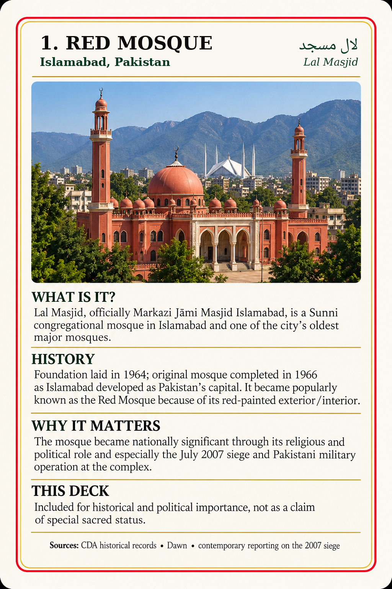

# Hanafi Learning Deck v1.6.2

A growing, printable and mobile-friendly library for learning **Islam through a consistent Hanafi framework**: belief, salah, purification, duʿā, daily worship, Qur'an, Arabic literacy, sacred places, the Names of Allah, Islamic history, and the wider Muslim world.

This project began with a simple problem: a learner can find thousands of isolated answers online and still struggle to find a clear path through them. The Hanafi Learning Deck tries to turn that maze into something you can actually hold, study, review, print, carry on your phone, and return to every day.

> **Current checkpoint:** **v1.6**
>
> **Status:** educational study aid, still undergoing full manual audit and pending qualified imam/scholar review.

## If you are not Muslim and found this by accident

You are welcome here.

You do not need to know Arabic, Islamic law, or mosque etiquette to begin. Islam starts with the most basic questions: **Who is Allah? What does it mean to worship Him alone? What did Prophet Muhammad ﷺ teach? Why do Muslims pray the way they do?**

A good first path through the project is:

1. **Card 1 — Allah**
2. **Card 4 — The Shahada**
3. **Card 3 — What Is the Hanafi School?**
4. **Card 34 — Surah al-Fatiha**

From there, the deck opens outward into prayer, purification, remembrance, fasting, travel, illness, sacred places, Arabic, the Names of Allah, and the history and geography of the Muslim world.

The goal is not to overwhelm a newcomer with jargon. It is to make each subject understandable enough that curiosity can become real study.

## What is the Hanafi school?

The Hanafi madhhab is one of the four major Sunni schools of Islamic law. It traces its legal tradition to **Imam Abu Hanifa** and generations of jurists who developed disciplined methods for understanding and applying the Qur'an, Sunnah, scholarly consensus, analogy, and other recognized legal principles.

A madhhab is not a separate religion or sect. It is a legal tradition and method. This project follows Hanafi fiqh so a learner can build one coherent foundation instead of unknowingly mixing rulings from different schools.

## Current library

At the v1.6 checkpoint, the repository contains **206 numbered cards across five independent sets**:

| Set | Status | Cards |
| --- | --- | ---: |
| Main Deck | established | 146 |
| Sacred Places Expansion | complete current set | 19 |
| 99 Names of Allah Expansion | complete current set | 12 |
| Arabic Alphabet Expansion | complete current set | 28 |
| Important Places of the Muslim World | **in progress** | **1 approved** |

Each expansion starts at Card 1 and keeps its own numbering.

## Card preview

These are actual cards from the repository.

<table>
<tr>
<td align="center"><strong>Allah</strong> </td>
<td align="center"><strong>Shahada</strong> </td>
<td align="center"><strong>Surah al-Fatiha</strong> </td>
</tr>
<tr>
<td align="center"><strong>Masjid al-Haram</strong> </td>
<td align="center"><strong>Arabic: Alif</strong> </td>
<td align="center"><strong>Important Places: Lal Masjid</strong> </td>
</tr>
</table>

The optional decorative card back is available in [`card-back/`](card-back/). The learning cards can also be printed single-sided.

## Study on a phone

The [`mobile-view/`](mobile-view/) folder provides scrollable galleries designed for phone use. On supported mobile browsers/apps, tap a displayed card to open the full-resolution PNG and use the normal pinch gesture for close reading.

The mobile layer is only a viewing aid. The printable PNG files remain authoritative.

## Downloads and collections

- **Complete current v1.6 repository ZIP:** https://github.com/dereksparks1982/Hanafi-Islam-Learning-Deck/archive/refs/heads/main.zip
- **Main Deck, Cards 1–146:** [`cards/`](cards/)
- **Sacred Places Expansion, Cards 1–19:** [`Sacred-Places-Expansion/`](Sacred-Places-Expansion/)
- **99 Names of Allah, Cards 1–12:** [`99-Names-of-Allah-Expansion/`](99-Names-of-Allah-Expansion/)
- **Arabic Alphabet, Cards 1–28:** [`Arabic-Alphabet-Expansion/`](Arabic-Alphabet-Expansion/)
- **Important Places of the Muslim World:** [`Important-Places-Expansion/`](Important-Places-Expansion/)
- **Printable main-deck sheets:** [`sheets/`](sheets/)
- **Mobile-friendly view:** [`mobile-view/`](mobile-view/)
- **Optional card back:** [`card-back/CardBack.png`](card-back/CardBack.png)

## Recommended learning links

These external resources complement the deck and remain on their original creators' channels:

- **Hanafi salah / prayer tutorial playlist — Man prayer (Hanafi):** https://www.youtube.com/playlist?list=PLgfsDRXXIm95Ef1zHj3ui3iqSJHhTwrdc
- **Arabic Alphabet Explained by an American — Language Simp:** https://www.youtube.com/watch?v=TLnr17rEFrQ&t=164s
- **Arabic learning video — Language Simp (starts at 5:37):** https://www.youtube.com/watch?v=xBG1eVwH_wg&t=337s

## The five current sets

### Main Deck — Cards 1–146

The main deck covers the practical backbone of everyday worship and Hanafi fiqh, including:

- foundations and the Hanafi school
- wudu, ghusl, tayammum, and purity
- the structure and movements of salah
- daily prayer times and rakʿah structure
- Witr and Qunut
- imam, follower, and latecomer situations
- Sajdat al-Sahw and Sajdat al-Tilawah
- voluntary prayers
- Jumuʿah, Ramadan, Tarawih, Laylat al-Qadr, and Eid
- janazah and end-of-life guidance
- travel and Qasr
- illness accommodations and chair/lying-down prayer
- Qur'anic and Prophetic protection duʿās
- daily remembrance and everyday duʿās

### Sacred Places Expansion — Cards 1–19

A photographic expansion covering major sacred, Hajj, Madinah, Al-Aqsa, and Seerah-related places, including Masjid al-Haram, the Kaʿbah, Maqam Ibrahim, Zamzam, Safa and Marwah, Mina, ʿArafat, Muzdalifah, Masjid an-Nabawi, the Rawdah, Jannat al-Baqiʿ, Quba, Qiblatayn, Al-Masjid al-Aqsa, the Dome of the Rock, Cave Hira, Cave Thawr, and Mount Uhud.

### 99 Names of Allah Expansion — Cards 1–12

A compact study set containing all 99 traditional Names in groups of nine per card, with Arabic, transliteration, concise English study meanings, and source notes.

### Arabic Alphabet Expansion — Cards 1–28

One letter per card, built for a learner who wants more than a chart. Cards include pronunciation, mouth/articulation guidance, letter forms, joining behavior, example words, and warnings about common mistakes.

Arabic literacy belongs here because it is a doorway into the Qur'an, hadith, fiqh, classical books, manuscripts, and Islamic scholarship in the language in which much of that tradition was written.

### Important Places of the Muslim World — v1.6, in progress

This new expansion covers places that matter to Muslim history, scholarship, culture, politics, or architecture **without automatically labeling those places sacred**.

**Card 1 is Lal Masjid — Islamabad, Pakistan.**

These cards are being built differently from the earlier sets. Because they depend heavily on photography, historical wording, Arabic, sourcing, and layout, **each card is reviewed individually before it is published**. There will be no unscreened bulk batch.

The next place is not considered approved merely because it appears on a candidate list. Each subject has to earn its card through research and review.

## Where the project goes next

The project is expanding carefully rather than simply chasing a card count.

### 1. Finish the manual audit

Every word, every card, every source. The current library is being reviewed for:

- Hanafi legal accuracy
- Qur'an and hadith citations
- Arabic and transliteration
- English wording
- source quality
- legitimate differences within Hanafi fiqh
- layout and legibility

Corrections will be discussed and sourced rather than silently rewritten.

### 2. Continue Important Places one card at a time

Candidate directions include Chinguetti and its manuscript tradition, important Afghan mosques and centers of learning, historic madrasas and libraries, and major centers of Islamic scholarship across Africa, Central Asia, South Asia, the Ottoman world, North Africa, and elsewhere.

### 3. The Hanafi School: Origins, Method & Legacy

A future high-detail expansion will explore Kufa, Imam Abu Hanifa, his teachers and students, Abu Yusuf, Muhammad al-Shaybani, Zufar, the legal method of the school, major Hanafi books and jurists, and the historical spread of the madhhab.

### 4. The Prophets of Islam

A sourced expansion on the prophets named in the Qur'an, carefully distinguishing Qur'anic material, sound hadith, and later historical reports.

### 5. The Life of Prophet Muhammad ﷺ

A substantial chronological sīrah expansion rather than a tiny summary. Important events will receive their own cards when the evidence supports them.

**Prophet Muhammad ﷺ will not be depicted.** No face, body, silhouette, shadow, outline, or stand-in figure will be used to represent him. The cards will use places, landscapes, maps, architecture, objects, manuscripts, routes, timelines, and environmental scenes.

See the full [`docs/roadmap.md`](docs/roadmap.md) for the working roadmap.

## Sourcing and corrections

This project is intentionally Hanafi-specific where fiqh is involved.

A Maliki, Shafiʿi, or Hanbali ruling is not automatically a correction to a Hanafi card merely because it is authentically sourced in that school.

When reporting a correction, please include:

1. the card number;
2. the exact wording at issue;
3. the proposed replacement wording;
4. a **specific named source**;
5. confirmation that the source reflects Hanafi fiqh when the issue is a Hanafi legal ruling.

A Qur'an or hadith citation alone does not always establish the Hanafi legal ruling on an issue, because juristic interpretation and application matter.

The deck is a **learning aid, not a fatwa service**. Personal or unusual cases should be taken to a qualified Hanafi scholar.

## Project documentation

Development and operating notes now live together in [`docs/`](docs/):

- [`docs/COMPANY_BIBLE.md`](docs/COMPANY_BIBLE.md) — project rules and approval gates
- [`docs/roadmap.md`](docs/roadmap.md) — current and future direction
- [`docs/changelog.md`](docs/changelog.md) — checkpoint history
- [`docs/build-notes.md`](docs/build-notes.md) — technical notes, including the solved binary-image upload workflow

Scholarly/source material remains separate in [`AUDIT_AND_SOURCES.md`](AUDIT_AND_SOURCES.md), [`IMAM_REVIEW_NOTES.md`](IMAM_REVIEW_NOTES.md), and the source notes inside individual expansions.

## Noncommercial license

The Hanafi Learning Deck is licensed under **Creative Commons Attribution-NonCommercial-ShareAlike 4.0 International (CC BY-NC-SA 4.0)**.

You may download, print, copy, share, teach from, and adapt these materials for personal, educational, mosque, classroom, study-group, community, and other **noncommercial** purposes.

You may not sell the cards, charge for access to them, or include the deck or its adaptations in a commercial product or bundle.

If you adapt the deck, credit the Hanafi Learning Deck project, indicate that changes were made, keep the adapted version noncommercial, and distribute it under the same license.

The purpose of this project is Islamic education and benefit, not commercial profit.

Full license: [`LICENSE`](LICENSE)

---

**Hanafi Learning Deck — v1.6 development checkpoint**
