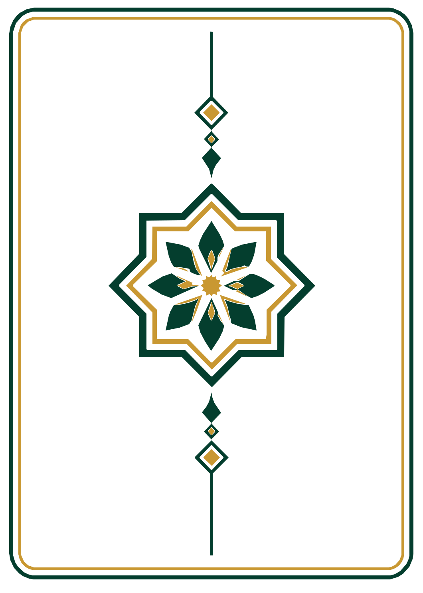

# Hanafi Learning Deck

A practical, printable **Hanafi study deck** for learning salah, purification, duʿā, daily worship, travel rulings, illness accommodations, special prayers, spiritual protection, sacred places, the Names of Allah, and other common situations in Muslim life.

The deck is designed so that a learner can pick up a card, understand what it is teaching, and then go deeper through the notes and sources at the bottom. It is intentionally structured more like a study reference than a bare flash-card set.

> **Status:** Hanafi study aid, pending imam review.

> **Development checkpoint:** **v1.4 R3**. Current repository: Main Deck Cards 1–146, Sacred Places Cards 1–19, and 99 Names of Allah Cards 1–12.

## Card Preview

These are the **actual card files from this repository**, shown here so visitors immediately see the real deck before downloading anything.

<table>
<tr>
<td align="center"><strong>Allah</strong> </td>
<td align="center"><strong>Shahada</strong> </td>
<td align="center"><strong>What Is the Hanafi School?</strong> </td>
</tr>
<tr>
<td align="center"><strong>Surah Al-Fatiha</strong> </td>
<td align="center"><strong>Before Eating</strong> </td>
<td align="center"><strong>Optional Card Back</strong> </td>
</tr>
</table>

The decorative card back is **optional**. The learning cards can be printed single-sided to conserve ink, printed back-to-back in other arrangements, or paired with the decorative back for a finished physical deck.

## Check for Updates

This deck is an **evolving educational project**. Cards, wording, sources, numbering, visual standards, and expansion sets may be corrected or improved in later releases.

If you downloaded or printed an earlier edition, please check this repository periodically to make sure you have the latest edition.

## Downloads

- **Complete current v1.4 R3 ZIP:** https://github.com/dereksparks1982/Hanafi-Islam-Learning-Deck/archive/refs/heads/main.zip
- **Main Deck, Cards 1–146:** https://github.com/dereksparks1982/Hanafi-Islam-Learning-Deck/tree/main/cards
- **Sacred Places, Cards 1–19:** https://github.com/dereksparks1982/Hanafi-Islam-Learning-Deck/tree/main/Sacred-Places-Expansion
- **99 Names of Allah, Cards 1–12:** https://github.com/dereksparks1982/Hanafi-Islam-Learning-Deck/tree/main/99-Names-of-Allah-Expansion
- **Printable sheets:** https://github.com/dereksparks1982/Hanafi-Islam-Learning-Deck/tree/main/sheets
- **Optional card back:** https://github.com/dereksparks1982/Hanafi-Islam-Learning-Deck/blob/main/card-back/CardBack.png

## Introduction

The Hanafi school is one of the four major Sunni schools of Islamic law (*madhhabs*). It traces its legal tradition to **Imam Abu Hanifa** and was developed and transmitted through generations of Hanafi jurists, including his students **Abu Yusuf** and **Muhammad al-Shaybani**.

A madhhab is not a separate religion or sect. It is a disciplined legal method for understanding and applying the Qur'an, Sunnah, scholarly consensus, analogy, and other recognized principles of Islamic law.

This project follows **Hanafi fiqh** so that a learner has one consistent framework instead of mixing unrelated rulings from different schools without realizing it. Where an important difference exists within the Hanafi school, or where a difference from another school is especially relevant, the deck should say so.

## Main Deck - Version 1.4 R1

The v1.4 main deck contains **146 study cards** covering:

- foundations and the meaning of the Hanafi school
- wudu, ghusl, tayammum, and purity
- the structure and movements of salah
- the five daily prayers and prayer times
- Witr and Qunut
- imam, follower, and latecomer situations
- Sajdat al-Sahw and Sajdat al-Tilawah
- Tahajjud, Duha, Awwabin, Tawbah, Istikhara, Salat al-Hajah, and other voluntary worship
- Jumuʿah, Ramadan, Tarawih, Laylat al-Qadr, and Eid
- Janazah and end-of-life guidance
- eclipse prayer and Istisqa
- travel, Qasr, illness, chair prayer, lying-down prayer, and danger
- Qur'anic and Prophetic protection duʿās
- daily-life duʿās and remembrance
- selected reflection material on cards that genuinely have room for it

The main deck remains in `cards/` and currently stops at **Card 146**.

Multipart study sequences are kept consecutive. In the current v1.4 main deck:

- **Cards 64–65:** Duʿa al-Qunut, Parts 1–2
- **Cards 72–73:** Istikhara Duʿa, Parts 1–2
- **Cards 99–100:** Ayat al-Kursi, Parts 1–2
- **Cards 144–146:** Before Eating, While Eating, After Eating

## Sacred Places Expansion - Version 1.4 R2

The Sacred Places Expansion is a separate **19-card expansion numbered 1–19**.

It is stored separately in:

`Sacred-Places-Expansion/`

The expansion begins with:

- **Card 1:** Sacred Places color key
- **Cards 2–19:** major sacred, Hajj, Madinah, Al-Aqsa, and Seerah-related locations

The locations include:

- Masjid al-Haram
- the Kaʿbah
- Maqam Ibrahim
- Zamzam
- Safa and Marwah
- Mina
- ʿArafat
- Muzdalifah
- Masjid an-Nabawi
- the Rawdah
- Jannat al-Baqiʿ
- Masjid Quba
- Masjid al-Qiblatayn
- Al-Masjid al-Aqsa
- the Dome of the Rock
- Jabal al-Nur and Cave Hira
- Cave Thawr
- Mount Uhud

The v1.4 R2 cards use the approved large photographic artwork with the current v1.4 card-frame standard.

The Sacred Places expansion is intentionally **not merged into the base `cards/` folder**. Expansion packs remain separate so learners can print and add only the sets they want.

## 99 Names of Allah Expansion - Version 1.4 R3

The 99 Names of Allah Expansion is a separate **12-card expansion numbered 1–12**.

- **Card 1:** expansion guide and source note
- **Cards 2–12:** all 99 Names arranged nine Names per card
- Arabic text, transliteration, and concise English study meanings
- traditional enumeration from Jamiʿ at-Tirmidhi 3507, with the source-strength distinction explained in the expansion notes

The v1.4 R3 design removes the solid green title banner to reduce printing ink, keeps a consistent 36 pt title size, and restores the header separator line.

## Expansion Roadmap

Future expansion packs remain in their own folders and downloadable packages rather than being mixed into the main deck.

### The Hanafi School: Origins, Method & Legacy

A high-detail expansion devoted to the Hanafi school itself, including:

- the scholarly environment of Kufa
- Imam Abu Hanifa
- his teachers and students
- Abu Yusuf, Muhammad al-Shaybani, Zufar, and later transmitters
- the development of Hanafi legal method
- Qur'an, Sunnah, ijmaʿ, qiyas, istihsan, and other recognized legal principles
- major Hanafi books and jurists
- how authoritative positions developed within the school
- historical spread through Muslim lands
- Hanafi scholarship in Central Asia, the Ottoman world, South Asia, Afghanistan, and elsewhere
- the present-day standing and continuing scholarly tradition of the Hanafi madhhab
- common misconceptions about Hanafi fiqh
- a study path from beginner material to advanced legal study

The final number of cards will be determined by the source material rather than an arbitrary limit.

### The Prophets of Islam

A dedicated expansion covering the prophets named in the Qur'an, with careful sourcing for:

- their peoples
- major events
- Qur'anic passages
- lessons
- relevant locations
- chronology where the evidence supports it
- distinctions between Qur'anic material, sound hadith, and later historical reports

### The Life of Prophet Muhammad ﷺ

A major planned expansion will cover **the life of Prophet Muhammad ﷺ from birth to death in chronological order**, using as many well-attested events as can reasonably be documented from reliable Islamic sources.

The goal is not to compress the Seerah into a tiny summary set. Important individual events should receive their own cards when the sources support doing so.

Planned coverage includes:

- ancestry, birth, childhood, and guardianship
- youth, trade, al-Amin, Hilf al-Fudul, and marriage to Khadijah رضي الله عنها
- rebuilding of the Kaʿbah and the Black Stone arbitration
- Cave Hira and the first revelation
- the earliest Muslims and Dar al-Arqam
- public preaching and Makkan persecution
- the migrations to Abyssinia
- Hamzah and ʿUmar accepting Islam
- the boycott of Banu Hashim
- the Year of Sorrow and journey to Taʾif
- Israʾ and Miʿraj
- the pledges of ʿAqabah
- the Hijrah, Cave Thawr, Quba, and arrival in Madinah
- establishment of the Madinan Muslim community
- Badr
- Uhud
- expeditions and major events between Uhud and the Trench
- the Battle of the Trench
- Hudaybiyyah
- letters and envoys to rulers
- Khaybar
- Muʾtah
- the Conquest of Makkah
- Hunayn and Taʾif
- Tabuk
- delegations and the spread of Islam across Arabia
- the Farewell Hajj
- the final illness, death, and burial
- a final source-audit pass for smaller journeys, treaties, family events, revelations tied to specific incidents, miracles, delegations, and other well-attested events worth preserving as individual cards

**Visual rule:** Prophet Muhammad ﷺ will not be depicted. No face, body, silhouette, shadow, outline, or stand-in figure will be used to represent him. Cards will instead use locations, landscapes, maps, architecture, objects, manuscripts, calligraphy, routes, battle maps, timelines, and environmental scenes.

### Important Places of the Muslim World

A separate expansion for Muslim places that are historically, intellectually, culturally, politically, or architecturally important **without claiming that they have special religious sanctity**.

This is intentionally different from the Sacred Places Expansion.

Candidate subjects for later research include:

- Lal Masjid in Pakistan
- Chinguetti in Mauritania
- important Afghan mosques and centers of learning
- historic madrasas
- manuscript libraries
- major centers of Islamic scholarship
- significant Ottoman, Central Asian, African, South Asian, and other Muslim institutions and cities

Individual sites will be researched before inclusion so that historical importance is not confused with sacred status.

## Design Approach

The deck uses a consistent visual language:

- **Black:** normal instruction and explanation
- **Red:** obligations, serious warnings, prohibitions, and critical cautions
- **Green:** Sunnah, recommended acts, duʿā, and positive practice
- **Gold:** Allah, Qur'an, and sacred emphasis
- **Blue:** timing, rakʿah counts, sequence, and prayer windows
- **Purple:** voluntary salah and optional worship
- additional colors are used only when they communicate a clear category

Current v1.4 cards use a continuous rounded category-colored outer border with a thin inner accent line. Corner medallions are not used.

Card titles use one large, consistent header style with breathing room above and below the title. Long titles wrap rather than shrinking into body-text size. Arabic, transliteration, translation, and instructional sections are spaced so the card remains easy to study rather than becoming a wall of text.

Physical prayer movements are described in words instead of relying on stick figures or ambiguous drawings.

## Corrections and Imam Review

This project is meant to improve.

If your imam or another qualified Hanafi scholar corrects a card, **please record the card number and the exact correction** and report it to this project.

If possible, also include the source or explanation the scholar gave.

That lets us revise the deck cleanly instead of allowing conflicting copies to circulate. If there is an error, we want to know about it so the card and the deck can be corrected for everyone who uses it.

Please do not assume that a card is beyond correction simply because it appears in a published version.

## Release and Development Notes

### Version 1.4 R3 - 99 Names of Allah Checkpoint

- published the 99 Names of Allah Expansion as independent Cards 1–12
- retained all 99 Names, nine Names per study card
- preserved Arabic, transliteration, concise English meanings, and source notes
- removed the solid green title banner to reduce printing ink
- standardized title size and restored the header separator line
- rebuilt three printable four-card sheets and QA material

### Version 1.4 R2 - Sacred Places Renumbering Checkpoint

- Sacred Places converted from historical deck-wide numbers 146–164 to independent Cards 1–19
- retained the approved large photographic Sacred Places artwork
- applied the v1.4 border standard
- kept the expansion separate from the main deck
- established the v1.4 independent-expansion numbering architecture in the working repository

### Version 1.4 R1 - Main Deck Replacement Checkpoint

- replaced the obsolete 145-card main deck
- established the current 146-card main deck
- grouped multipart cards into consecutive numbering
- consolidated eating guidance into Cards 144–146
- rebuilt printable sheets, manifests, source numbering, and QA material

### Version 1.3 - 99 Names of Allah Expansion

- Added a separate 12-card 99 Names of Allah Expansion
- Added the expansion guide and source note
- Added all 99 Names, nine Names per study card
- Included Arabic, transliteration, and concise English study meanings
- Documented the hadith-source distinction for the traditional enumeration

### Version 1.2 - Sacred Places Expansion

- Added a separate 19-card Sacred Places Expansion
- Added the Sacred Places color key
- Added 18 cards covering major sacred, Hajj, Madinah, Al-Aqsa, and Seerah-related locations
- Kept the then-current base deck unchanged

### Version 1.0 - Base Deck

- First public baseline of the Hanafi Learning Deck
- 145 cards
- Added an introductory card explaining what the Hanafi school is
- Added source lines and study-reference notes throughout the deck
- Added selected reflections only where enough space exists naturally
- Standardized large card headers
- Fixed label-column collisions on timing, prayer-map, travel, and similar cards
- Fixed unsupported special-character rendering
- Reworked vertical spacing so sparse cards use their space without increasing body-text size
- Rounded-border accent bars stop cleanly where the border curve begins
- Removed stick figures and described prayer movements in words
- Added a correction workflow for future imam/scholar review

## Important Note

This deck is a **learning aid**, not a fatwa service and not a substitute for a qualified teacher. Hanafi fiqh contains detail, nuance, and in some cases legitimate differences of transmitted opinion. Personal or unusual cases should be taken to a qualified Hanafi scholar.

## Repository Contents

- `cards/` - v1.4 Main Deck, Cards 1–146
- `card-back/` - optional printable decorative card back
- `Sacred-Places-Expansion/` - v1.4 R2 Sacred Places Expansion, Cards 1–19
- `99-Names-of-Allah-Expansion/` - v1.4 R3, Cards 1–12
- `sheets/` - printable four-card sheets for the main deck
- `CARD_MANIFEST.txt` - main-deck card index
- `AUDIT_AND_SOURCES.md` - sourcing and audit notes
- `IMAM_REVIEW_NOTES.md` - place to record corrections and review findings
- `QA_REPORT.txt` - build-quality checks
- `EXPANSION_ROADMAP.md` - current and planned expansion roadmap

## Contributing Corrections

When reporting a correction, please include:

1. the **card number**
2. the **exact wording that should change**
3. the **replacement wording**
4. the **reason or source**, when available
5. whether the correction came from an imam or qualified Hanafi scholar

That format makes corrections much easier to verify and apply accurately.

---

**Hanafi Learning Deck - v1.4 development series**

## Noncommercial License

The Hanafi Learning Deck is licensed under **Creative Commons Attribution-NonCommercial-ShareAlike 4.0 International (CC BY-NC-SA 4.0)**.

You may **download, print, copy, share, teach from, and adapt** these materials for personal, educational, mosque, classroom, study-group, community, and other **noncommercial** purposes.

**You may not sell these cards, charge for access to them, include them in a product or bundle for sale, or otherwise use the deck or its adaptations commercially.**

If you adapt the deck, credit the Hanafi Learning Deck project, indicate that changes were made, keep the adapted version noncommercial, and distribute it under the same **CC BY-NC-SA 4.0** license.

The purpose of this project is Islamic education and benefit, **not commercial profit**.

Full license details are in [`LICENSE`](LICENSE).

Official license: https://creativecommons.org/licenses/by-nc-sa/4.0/
