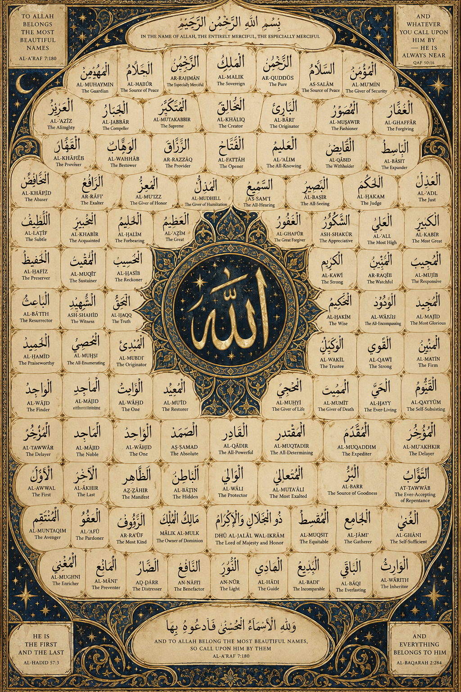

# Main Deck — Mobile View

147 cards. This is a viewing page only; the original printable PNG files remain authoritative.

[Back to mobile-view index](README.md)

**Zoom:** Tap any card to open the full-resolution PNG, then use the normal two-finger pinch gesture to zoom.

## Card 00

<a href="https://raw.githubusercontent.com/dereksparks1982/Hanafi-Islam-Learning-Deck/main/cards/card_000.png?release=v1.7">Open full-size card / pinch to zoom</a>

    

---

## Card 001

<a href="https://raw.githubusercontent.com/dereksparks1982/Hanafi-Islam-Learning-Deck/main/cards/card_001.png?release=v1.7">Open full-size card / pinch to zoom</a>

    

---

## Card 002

<a href="https://raw.githubusercontent.com/dereksparks1982/Hanafi-Islam-Learning-Deck/main/cards/card_002.png?release=v1.7">Open full-size card / pinch to zoom</a>

    

---

## Card 003

<a href="https://raw.githubusercontent.com/dereksparks1982/Hanafi-Islam-Learning-Deck/main/cards/card_003.png?release=v1.7">Open full-size card / pinch to zoom</a>

    

---

## Card 004

<a href="https://raw.githubusercontent.com/dereksparks1982/Hanafi-Islam-Learning-Deck/main/cards/card_004.png?release=v1.7">Open full-size card / pinch to zoom</a>

    

---

## Card 005

<a href="https://raw.githubusercontent.com/dereksparks1982/Hanafi-Islam-Learning-Deck/main/cards/card_005.png?release=v1.7">Open full-size card / pinch to zoom</a>

    

---

## Card 006

<a href="https://raw.githubusercontent.com/dereksparks1982/Hanafi-Islam-Learning-Deck/main/cards/card_006.png?release=v1.7">Open full-size card / pinch to zoom</a>

    

---

## Card 007

<a href="https://raw.githubusercontent.com/dereksparks1982/Hanafi-Islam-Learning-Deck/main/cards/card_007.png?release=v1.7">Open full-size card / pinch to zoom</a>

    

---

## Card 008

<a href="https://raw.githubusercontent.com/dereksparks1982/Hanafi-Islam-Learning-Deck/main/cards/card_008.png?release=v1.7">Open full-size card / pinch to zoom</a>

    

---

## Card 009

<a href="https://raw.githubusercontent.com/dereksparks1982/Hanafi-Islam-Learning-Deck/main/cards/card_009.png?release=v1.7">Open full-size card / pinch to zoom</a>

    

---

## Card 010

<a href="https://raw.githubusercontent.com/dereksparks1982/Hanafi-Islam-Learning-Deck/main/cards/card_010.png?release=v1.7">Open full-size card / pinch to zoom</a>

    

---

## Card 011

<a href="https://raw.githubusercontent.com/dereksparks1982/Hanafi-Islam-Learning-Deck/main/cards/card_011.png?release=v1.7">Open full-size card / pinch to zoom</a>

    

---

## Card 012

<a href="https://raw.githubusercontent.com/dereksparks1982/Hanafi-Islam-Learning-Deck/main/cards/card_012.png?release=v1.7">Open full-size card / pinch to zoom</a>

    

---

## Card 013

<a href="https://raw.githubusercontent.com/dereksparks1982/Hanafi-Islam-Learning-Deck/main/cards/card_013.png?release=v1.7">Open full-size card / pinch to zoom</a>

    

---

## Card 014

<a href="https://raw.githubusercontent.com/dereksparks1982/Hanafi-Islam-Learning-Deck/main/cards/card_014.png?release=v1.7">Open full-size card / pinch to zoom</a>

    

---

## Card 015

<a href="https://raw.githubusercontent.com/dereksparks1982/Hanafi-Islam-Learning-Deck/main/cards/card_015.png?release=v1.7">Open full-size card / pinch to zoom</a>

    

---

## Card 016

<a href="https://raw.githubusercontent.com/dereksparks1982/Hanafi-Islam-Learning-Deck/main/cards/card_016.png?release=v1.7">Open full-size card / pinch to zoom</a>

    

---

## Card 017

<a href="https://raw.githubusercontent.com/dereksparks1982/Hanafi-Islam-Learning-Deck/main/cards/card_017.png?release=v1.7">Open full-size card / pinch to zoom</a>

    

---

## Card 018

<a href="https://raw.githubusercontent.com/dereksparks1982/Hanafi-Islam-Learning-Deck/main/cards/card_018.png?release=v1.7">Open full-size card / pinch to zoom</a>

    

---

## Card 019

<a href="https://raw.githubusercontent.com/dereksparks1982/Hanafi-Islam-Learning-Deck/main/cards/card_019.png?release=v1.7">Open full-size card / pinch to zoom</a>

    

---

## Card 020

<a href="https://raw.githubusercontent.com/dereksparks1982/Hanafi-Islam-Learning-Deck/main/cards/card_020.png?release=v1.7">Open full-size card / pinch to zoom</a>

    

---

## Card 021

<a href="https://raw.githubusercontent.com/dereksparks1982/Hanafi-Islam-Learning-Deck/main/cards/card_021.png?release=v1.7">Open full-size card / pinch to zoom</a>

    

---

## Card 022

<a href="https://raw.githubusercontent.com/dereksparks1982/Hanafi-Islam-Learning-Deck/main/cards/card_022.png?release=v1.7">Open full-size card / pinch to zoom</a>

    

---

## Card 023

<a href="https://raw.githubusercontent.com/dereksparks1982/Hanafi-Islam-Learning-Deck/main/cards/card_023.png?release=v1.7">Open full-size card / pinch to zoom</a>

    

---

## Card 024

<a href="https://raw.githubusercontent.com/dereksparks1982/Hanafi-Islam-Learning-Deck/main/cards/card_024.png?release=v1.7">Open full-size card / pinch to zoom</a>

    

---

## Card 025

<a href="https://raw.githubusercontent.com/dereksparks1982/Hanafi-Islam-Learning-Deck/main/cards/card_025.png?release=v1.7">Open full-size card / pinch to zoom</a>

    

---

## Card 026

<a href="https://raw.githubusercontent.com/dereksparks1982/Hanafi-Islam-Learning-Deck/main/cards/card_026.png?release=v1.7">Open full-size card / pinch to zoom</a>

    

---

## Card 027

<a href="https://raw.githubusercontent.com/dereksparks1982/Hanafi-Islam-Learning-Deck/main/cards/card_027.png?release=v1.7">Open full-size card / pinch to zoom</a>

    

---

## Card 028

<a href="https://raw.githubusercontent.com/dereksparks1982/Hanafi-Islam-Learning-Deck/main/cards/card_028.png?release=v1.7">Open full-size card / pinch to zoom</a>

    

---

## Card 029

<a href="https://raw.githubusercontent.com/dereksparks1982/Hanafi-Islam-Learning-Deck/main/cards/card_029.png?release=v1.7">Open full-size card / pinch to zoom</a>

    

---

## Card 030

<a href="https://raw.githubusercontent.com/dereksparks1982/Hanafi-Islam-Learning-Deck/main/cards/card_030.png?release=v1.7">Open full-size card / pinch to zoom</a>

    

---

## Card 031

<a href="https://raw.githubusercontent.com/dereksparks1982/Hanafi-Islam-Learning-Deck/main/cards/card_031.png?release=v1.7">Open full-size card / pinch to zoom</a>

    

---

## Card 032

<a href="https://raw.githubusercontent.com/dereksparks1982/Hanafi-Islam-Learning-Deck/main/cards/card_032.png?release=v1.7">Open full-size card / pinch to zoom</a>

    

---

## Card 033

<a href="https://raw.githubusercontent.com/dereksparks1982/Hanafi-Islam-Learning-Deck/main/cards/card_033.png?release=v1.7">Open full-size card / pinch to zoom</a>

    

---

## Card 034

<a href="https://raw.githubusercontent.com/dereksparks1982/Hanafi-Islam-Learning-Deck/main/cards/card_034.png?release=v1.7">Open full-size card / pinch to zoom</a>

    

---

## Card 035

<a href="https://raw.githubusercontent.com/dereksparks1982/Hanafi-Islam-Learning-Deck/main/cards/card_035.png?release=v1.7">Open full-size card / pinch to zoom</a>

    

---

## Card 036

<a href="https://raw.githubusercontent.com/dereksparks1982/Hanafi-Islam-Learning-Deck/main/cards/card_036.png?release=v1.7">Open full-size card / pinch to zoom</a>

    

---

## Card 037

<a href="https://raw.githubusercontent.com/dereksparks1982/Hanafi-Islam-Learning-Deck/main/cards/card_037.png?release=v1.7">Open full-size card / pinch to zoom</a>

    

---

## Card 038

<a href="https://raw.githubusercontent.com/dereksparks1982/Hanafi-Islam-Learning-Deck/main/cards/card_038.png?release=v1.7">Open full-size card / pinch to zoom</a>

    

---

## Card 039

<a href="https://raw.githubusercontent.com/dereksparks1982/Hanafi-Islam-Learning-Deck/main/cards/card_039.png?release=v1.7">Open full-size card / pinch to zoom</a>

    

---

## Card 040

<a href="https://raw.githubusercontent.com/dereksparks1982/Hanafi-Islam-Learning-Deck/main/cards/card_040.png?release=v1.7">Open full-size card / pinch to zoom</a>

    

---

## Card 041

<a href="https://raw.githubusercontent.com/dereksparks1982/Hanafi-Islam-Learning-Deck/main/cards/card_041.png?release=v1.7">Open full-size card / pinch to zoom</a>

    

---

## Card 042

<a href="https://raw.githubusercontent.com/dereksparks1982/Hanafi-Islam-Learning-Deck/main/cards/card_042.png?release=v1.7">Open full-size card / pinch to zoom</a>

    

---

## Card 043

<a href="https://raw.githubusercontent.com/dereksparks1982/Hanafi-Islam-Learning-Deck/main/cards/card_043.png?release=v1.7">Open full-size card / pinch to zoom</a>

    

---

## Card 044

<a href="https://raw.githubusercontent.com/dereksparks1982/Hanafi-Islam-Learning-Deck/main/cards/card_044.png?release=v1.7">Open full-size card / pinch to zoom</a>

    

---

## Card 045

<a href="https://raw.githubusercontent.com/dereksparks1982/Hanafi-Islam-Learning-Deck/main/cards/card_045.png?release=v1.7">Open full-size card / pinch to zoom</a>

    

---

## Card 046

<a href="https://raw.githubusercontent.com/dereksparks1982/Hanafi-Islam-Learning-Deck/main/cards/card_046.png?release=v1.7">Open full-size card / pinch to zoom</a>

    

---

## Card 047

<a href="https://raw.githubusercontent.com/dereksparks1982/Hanafi-Islam-Learning-Deck/main/cards/card_047.png?release=v1.7">Open full-size card / pinch to zoom</a>

    

---

## Card 048

<a href="https://raw.githubusercontent.com/dereksparks1982/Hanafi-Islam-Learning-Deck/main/cards/card_048.png?release=v1.7">Open full-size card / pinch to zoom</a>

    

---

## Card 049

<a href="https://raw.githubusercontent.com/dereksparks1982/Hanafi-Islam-Learning-Deck/main/cards/card_049.png?release=v1.7">Open full-size card / pinch to zoom</a>

    

---

## Card 050

<a href="https://raw.githubusercontent.com/dereksparks1982/Hanafi-Islam-Learning-Deck/main/cards/card_050.png?release=v1.7">Open full-size card / pinch to zoom</a>

    

---

## Card 051

<a href="https://raw.githubusercontent.com/dereksparks1982/Hanafi-Islam-Learning-Deck/main/cards/card_051.png?release=v1.7">Open full-size card / pinch to zoom</a>

    

---

## Card 052

<a href="https://raw.githubusercontent.com/dereksparks1982/Hanafi-Islam-Learning-Deck/main/cards/card_052.png?release=v1.7">Open full-size card / pinch to zoom</a>

    

---

## Card 053

<a href="https://raw.githubusercontent.com/dereksparks1982/Hanafi-Islam-Learning-Deck/main/cards/card_053.png?release=v1.7">Open full-size card / pinch to zoom</a>

    

---

## Card 054

<a href="https://raw.githubusercontent.com/dereksparks1982/Hanafi-Islam-Learning-Deck/main/cards/card_054.png?release=v1.7">Open full-size card / pinch to zoom</a>

    

---

## Card 055

<a href="https://raw.githubusercontent.com/dereksparks1982/Hanafi-Islam-Learning-Deck/main/cards/card_055.png?release=v1.7">Open full-size card / pinch to zoom</a>

    

---

## Card 056

<a href="https://raw.githubusercontent.com/dereksparks1982/Hanafi-Islam-Learning-Deck/main/cards/card_056.png?release=v1.7">Open full-size card / pinch to zoom</a>

    

---

## Card 057

<a href="https://raw.githubusercontent.com/dereksparks1982/Hanafi-Islam-Learning-Deck/main/cards/card_057.png?release=v1.7">Open full-size card / pinch to zoom</a>

    

---

## Card 058

<a href="https://raw.githubusercontent.com/dereksparks1982/Hanafi-Islam-Learning-Deck/main/cards/card_058.png?release=v1.7">Open full-size card / pinch to zoom</a>

    

---

## Card 059

<a href="https://raw.githubusercontent.com/dereksparks1982/Hanafi-Islam-Learning-Deck/main/cards/card_059.png?release=v1.7">Open full-size card / pinch to zoom</a>

    

---

## Card 060

<a href="https://raw.githubusercontent.com/dereksparks1982/Hanafi-Islam-Learning-Deck/main/cards/card_060.png?release=v1.7">Open full-size card / pinch to zoom</a>

    

---

## Card 061

<a href="https://raw.githubusercontent.com/dereksparks1982/Hanafi-Islam-Learning-Deck/main/cards/card_061.png?release=v1.7">Open full-size card / pinch to zoom</a>

    

---

## Card 062

<a href="https://raw.githubusercontent.com/dereksparks1982/Hanafi-Islam-Learning-Deck/main/cards/card_062.png?release=v1.7">Open full-size card / pinch to zoom</a>

    

---

## Card 063

<a href="https://raw.githubusercontent.com/dereksparks1982/Hanafi-Islam-Learning-Deck/main/cards/card_063.png?release=v1.7">Open full-size card / pinch to zoom</a>

    

---

## Card 064

<a href="https://raw.githubusercontent.com/dereksparks1982/Hanafi-Islam-Learning-Deck/main/cards/card_064.png?release=v1.7">Open full-size card / pinch to zoom</a>

    

---

## Card 065

<a href="https://raw.githubusercontent.com/dereksparks1982/Hanafi-Islam-Learning-Deck/main/cards/card_065.png?release=v1.7">Open full-size card / pinch to zoom</a>

    

---

## Card 066

<a href="https://raw.githubusercontent.com/dereksparks1982/Hanafi-Islam-Learning-Deck/main/cards/card_066.png?release=v1.7">Open full-size card / pinch to zoom</a>

    

---

## Card 067

<a href="https://raw.githubusercontent.com/dereksparks1982/Hanafi-Islam-Learning-Deck/main/cards/card_067.png?release=v1.7">Open full-size card / pinch to zoom</a>

    

---

## Card 068

<a href="https://raw.githubusercontent.com/dereksparks1982/Hanafi-Islam-Learning-Deck/main/cards/card_068.png?release=v1.7">Open full-size card / pinch to zoom</a>

    

---

## Card 069

<a href="https://raw.githubusercontent.com/dereksparks1982/Hanafi-Islam-Learning-Deck/main/cards/card_069.png?release=v1.7">Open full-size card / pinch to zoom</a>

    

---

## Card 070

<a href="https://raw.githubusercontent.com/dereksparks1982/Hanafi-Islam-Learning-Deck/main/cards/card_070.png?release=v1.7">Open full-size card / pinch to zoom</a>

    

---

## Card 071

<a href="https://raw.githubusercontent.com/dereksparks1982/Hanafi-Islam-Learning-Deck/main/cards/card_071.png?release=v1.7">Open full-size card / pinch to zoom</a>

    

---

## Card 072

<a href="https://raw.githubusercontent.com/dereksparks1982/Hanafi-Islam-Learning-Deck/main/cards/card_072.png?release=v1.7">Open full-size card / pinch to zoom</a>

    

---

## Card 073

<a href="https://raw.githubusercontent.com/dereksparks1982/Hanafi-Islam-Learning-Deck/main/cards/card_073.png?release=v1.7">Open full-size card / pinch to zoom</a>

    

---

## Card 074

<a href="https://raw.githubusercontent.com/dereksparks1982/Hanafi-Islam-Learning-Deck/main/cards/card_074.png?release=v1.7">Open full-size card / pinch to zoom</a>

    

---

## Card 075

<a href="https://raw.githubusercontent.com/dereksparks1982/Hanafi-Islam-Learning-Deck/main/cards/card_075.png?release=v1.7">Open full-size card / pinch to zoom</a>

    

---

## Card 076

<a href="https://raw.githubusercontent.com/dereksparks1982/Hanafi-Islam-Learning-Deck/main/cards/card_076.png?release=v1.7">Open full-size card / pinch to zoom</a>

    

---

## Card 077

<a href="https://raw.githubusercontent.com/dereksparks1982/Hanafi-Islam-Learning-Deck/main/cards/card_077.png?release=v1.7">Open full-size card / pinch to zoom</a>

    

---

## Card 078

<a href="https://raw.githubusercontent.com/dereksparks1982/Hanafi-Islam-Learning-Deck/main/cards/card_078.png?release=v1.7">Open full-size card / pinch to zoom</a>

    

---

## Card 079

<a href="https://raw.githubusercontent.com/dereksparks1982/Hanafi-Islam-Learning-Deck/main/cards/card_079.png?release=v1.7">Open full-size card / pinch to zoom</a>

    

---

## Card 080

<a href="https://raw.githubusercontent.com/dereksparks1982/Hanafi-Islam-Learning-Deck/main/cards/card_080.png?release=v1.7">Open full-size card / pinch to zoom</a>

    

---

## Card 081

<a href="https://raw.githubusercontent.com/dereksparks1982/Hanafi-Islam-Learning-Deck/main/cards/card_081.png?release=v1.7">Open full-size card / pinch to zoom</a>

    

---

## Card 082

<a href="https://raw.githubusercontent.com/dereksparks1982/Hanafi-Islam-Learning-Deck/main/cards/card_082.png?release=v1.7">Open full-size card / pinch to zoom</a>

    

---

## Card 083

<a href="https://raw.githubusercontent.com/dereksparks1982/Hanafi-Islam-Learning-Deck/main/cards/card_083.png?release=v1.7">Open full-size card / pinch to zoom</a>

    

---

## Card 084

<a href="https://raw.githubusercontent.com/dereksparks1982/Hanafi-Islam-Learning-Deck/main/cards/card_084.png?release=v1.7">Open full-size card / pinch to zoom</a>

    

---

## Card 085

<a href="https://raw.githubusercontent.com/dereksparks1982/Hanafi-Islam-Learning-Deck/main/cards/card_085.png?release=v1.7">Open full-size card / pinch to zoom</a>

    

---

## Card 086

<a href="https://raw.githubusercontent.com/dereksparks1982/Hanafi-Islam-Learning-Deck/main/cards/card_086.png?release=v1.7">Open full-size card / pinch to zoom</a>

    

---

## Card 087

<a href="https://raw.githubusercontent.com/dereksparks1982/Hanafi-Islam-Learning-Deck/main/cards/card_087.png?release=v1.7">Open full-size card / pinch to zoom</a>

    

---

## Card 088

<a href="https://raw.githubusercontent.com/dereksparks1982/Hanafi-Islam-Learning-Deck/main/cards/card_088.png?release=v1.7">Open full-size card / pinch to zoom</a>

    

---

## Card 089

<a href="https://raw.githubusercontent.com/dereksparks1982/Hanafi-Islam-Learning-Deck/main/cards/card_089.png?release=v1.7">Open full-size card / pinch to zoom</a>

    

---

## Card 090

<a href="https://raw.githubusercontent.com/dereksparks1982/Hanafi-Islam-Learning-Deck/main/cards/card_090.png?release=v1.7">Open full-size card / pinch to zoom</a>

    

---

## Card 091

<a href="https://raw.githubusercontent.com/dereksparks1982/Hanafi-Islam-Learning-Deck/main/cards/card_091.png?release=v1.7">Open full-size card / pinch to zoom</a>

    

---

## Card 092

<a href="https://raw.githubusercontent.com/dereksparks1982/Hanafi-Islam-Learning-Deck/main/cards/card_092.png?release=v1.7">Open full-size card / pinch to zoom</a>

    

---

## Card 093

<a href="https://raw.githubusercontent.com/dereksparks1982/Hanafi-Islam-Learning-Deck/main/cards/card_093.png?release=v1.7">Open full-size card / pinch to zoom</a>

    

---

## Card 094

<a href="https://raw.githubusercontent.com/dereksparks1982/Hanafi-Islam-Learning-Deck/main/cards/card_094.png?release=v1.7">Open full-size card / pinch to zoom</a>

    

---

## Card 095

<a href="https://raw.githubusercontent.com/dereksparks1982/Hanafi-Islam-Learning-Deck/main/cards/card_095.png?release=v1.7">Open full-size card / pinch to zoom</a>

    

---

## Card 096

<a href="https://raw.githubusercontent.com/dereksparks1982/Hanafi-Islam-Learning-Deck/main/cards/card_096.png?release=v1.7">Open full-size card / pinch to zoom</a>

    

---

## Card 097

<a href="https://raw.githubusercontent.com/dereksparks1982/Hanafi-Islam-Learning-Deck/main/cards/card_097.png?release=v1.7">Open full-size card / pinch to zoom</a>

    

---

## Card 098

<a href="https://raw.githubusercontent.com/dereksparks1982/Hanafi-Islam-Learning-Deck/main/cards/card_098.png?release=v1.7">Open full-size card / pinch to zoom</a>

    

---

## Card 099

<a href="https://raw.githubusercontent.com/dereksparks1982/Hanafi-Islam-Learning-Deck/main/cards/card_099.png?release=v1.7">Open full-size card / pinch to zoom</a>

    

---

## Card 100

<a href="https://raw.githubusercontent.com/dereksparks1982/Hanafi-Islam-Learning-Deck/main/cards/card_100.png?release=v1.7">Open full-size card / pinch to zoom</a>

    

---

## Card 101

<a href="https://raw.githubusercontent.com/dereksparks1982/Hanafi-Islam-Learning-Deck/main/cards/card_101.png?release=v1.7">Open full-size card / pinch to zoom</a>

    

---

## Card 102

<a href="https://raw.githubusercontent.com/dereksparks1982/Hanafi-Islam-Learning-Deck/main/cards/card_102.png?release=v1.7">Open full-size card / pinch to zoom</a>

    

---

## Card 103

<a href="https://raw.githubusercontent.com/dereksparks1982/Hanafi-Islam-Learning-Deck/main/cards/card_103.png?release=v1.7">Open full-size card / pinch to zoom</a>

    

---

## Card 104

<a href="https://raw.githubusercontent.com/dereksparks1982/Hanafi-Islam-Learning-Deck/main/cards/card_104.png?release=v1.7">Open full-size card / pinch to zoom</a>

    

---

## Card 105

<a href="https://raw.githubusercontent.com/dereksparks1982/Hanafi-Islam-Learning-Deck/main/cards/card_105.png?release=v1.7">Open full-size card / pinch to zoom</a>

    

---

## Card 106

<a href="https://raw.githubusercontent.com/dereksparks1982/Hanafi-Islam-Learning-Deck/main/cards/card_106.png?release=v1.7">Open full-size card / pinch to zoom</a>

    

---

## Card 107

<a href="https://raw.githubusercontent.com/dereksparks1982/Hanafi-Islam-Learning-Deck/main/cards/card_107.png?release=v1.7">Open full-size card / pinch to zoom</a>

    

---

## Card 108

<a href="https://raw.githubusercontent.com/dereksparks1982/Hanafi-Islam-Learning-Deck/main/cards/card_108.png?release=v1.7">Open full-size card / pinch to zoom</a>

    

---

## Card 109

<a href="https://raw.githubusercontent.com/dereksparks1982/Hanafi-Islam-Learning-Deck/main/cards/card_109.png?release=v1.7">Open full-size card / pinch to zoom</a>

    

---

## Card 110

<a href="https://raw.githubusercontent.com/dereksparks1982/Hanafi-Islam-Learning-Deck/main/cards/card_110.png?release=v1.7">Open full-size card / pinch to zoom</a>

    

---

## Card 111

<a href="https://raw.githubusercontent.com/dereksparks1982/Hanafi-Islam-Learning-Deck/main/cards/card_111.png?release=v1.7">Open full-size card / pinch to zoom</a>

    

---

## Card 112

<a href="https://raw.githubusercontent.com/dereksparks1982/Hanafi-Islam-Learning-Deck/main/cards/card_112.png?release=v1.7">Open full-size card / pinch to zoom</a>

    

---

## Card 113

<a href="https://raw.githubusercontent.com/dereksparks1982/Hanafi-Islam-Learning-Deck/main/cards/card_113.png?release=v1.7">Open full-size card / pinch to zoom</a>

    

---

## Card 114

<a href="https://raw.githubusercontent.com/dereksparks1982/Hanafi-Islam-Learning-Deck/main/cards/card_114.png?release=v1.7">Open full-size card / pinch to zoom</a>

    

---

## Card 115

<a href="https://raw.githubusercontent.com/dereksparks1982/Hanafi-Islam-Learning-Deck/main/cards/card_115.png?release=v1.7">Open full-size card / pinch to zoom</a>

    

---

## Card 116

<a href="https://raw.githubusercontent.com/dereksparks1982/Hanafi-Islam-Learning-Deck/main/cards/card_116.png?release=v1.7">Open full-size card / pinch to zoom</a>

    

---

## Card 117

<a href="https://raw.githubusercontent.com/dereksparks1982/Hanafi-Islam-Learning-Deck/main/cards/card_117.png?release=v1.7">Open full-size card / pinch to zoom</a>

    

---

## Card 118

<a href="https://raw.githubusercontent.com/dereksparks1982/Hanafi-Islam-Learning-Deck/main/cards/card_118.png?release=v1.7">Open full-size card / pinch to zoom</a>

    

---

## Card 119

<a href="https://raw.githubusercontent.com/dereksparks1982/Hanafi-Islam-Learning-Deck/main/cards/card_119.png?release=v1.7">Open full-size card / pinch to zoom</a>

    

---

## Card 120

<a href="https://raw.githubusercontent.com/dereksparks1982/Hanafi-Islam-Learning-Deck/main/cards/card_120.png?release=v1.7">Open full-size card / pinch to zoom</a>

    

---

## Card 121

<a href="https://raw.githubusercontent.com/dereksparks1982/Hanafi-Islam-Learning-Deck/main/cards/card_121.png?release=v1.7">Open full-size card / pinch to zoom</a>

    

---

## Card 122

<a href="https://raw.githubusercontent.com/dereksparks1982/Hanafi-Islam-Learning-Deck/main/cards/card_122.png?release=v1.7">Open full-size card / pinch to zoom</a>

    

---

## Card 123

<a href="https://raw.githubusercontent.com/dereksparks1982/Hanafi-Islam-Learning-Deck/main/cards/card_123.png?release=v1.7">Open full-size card / pinch to zoom</a>

    

---

## Card 124

<a href="https://raw.githubusercontent.com/dereksparks1982/Hanafi-Islam-Learning-Deck/main/cards/card_124.png?release=v1.7">Open full-size card / pinch to zoom</a>

    

---

## Card 125

<a href="https://raw.githubusercontent.com/dereksparks1982/Hanafi-Islam-Learning-Deck/main/cards/card_125.png?release=v1.7">Open full-size card / pinch to zoom</a>

    

---

## Card 126

<a href="https://raw.githubusercontent.com/dereksparks1982/Hanafi-Islam-Learning-Deck/main/cards/card_126.png?release=v1.7">Open full-size card / pinch to zoom</a>

    

---

## Card 127

<a href="https://raw.githubusercontent.com/dereksparks1982/Hanafi-Islam-Learning-Deck/main/cards/card_127.png?release=v1.7">Open full-size card / pinch to zoom</a>

    

---

## Card 128

<a href="https://raw.githubusercontent.com/dereksparks1982/Hanafi-Islam-Learning-Deck/main/cards/card_128.png?release=v1.7">Open full-size card / pinch to zoom</a>

    

---

## Card 129

<a href="https://raw.githubusercontent.com/dereksparks1982/Hanafi-Islam-Learning-Deck/main/cards/card_129.png?release=v1.7">Open full-size card / pinch to zoom</a>

    

---

## Card 130

<a href="https://raw.githubusercontent.com/dereksparks1982/Hanafi-Islam-Learning-Deck/main/cards/card_130.png?release=v1.7">Open full-size card / pinch to zoom</a>

    

---

## Card 131

<a href="https://raw.githubusercontent.com/dereksparks1982/Hanafi-Islam-Learning-Deck/main/cards/card_131.png?release=v1.7">Open full-size card / pinch to zoom</a>

    

---

## Card 132

<a href="https://raw.githubusercontent.com/dereksparks1982/Hanafi-Islam-Learning-Deck/main/cards/card_132.png?release=v1.7">Open full-size card / pinch to zoom</a>

    

---

## Card 133

<a href="https://raw.githubusercontent.com/dereksparks1982/Hanafi-Islam-Learning-Deck/main/cards/card_133.png?release=v1.7">Open full-size card / pinch to zoom</a>

    

---

## Card 134

<a href="https://raw.githubusercontent.com/dereksparks1982/Hanafi-Islam-Learning-Deck/main/cards/card_134.png?release=v1.7">Open full-size card / pinch to zoom</a>

    

---

## Card 135

<a href="https://raw.githubusercontent.com/dereksparks1982/Hanafi-Islam-Learning-Deck/main/cards/card_135.png?release=v1.7">Open full-size card / pinch to zoom</a>

    

---

## Card 136

<a href="https://raw.githubusercontent.com/dereksparks1982/Hanafi-Islam-Learning-Deck/main/cards/card_136.png?release=v1.7">Open full-size card / pinch to zoom</a>

    

---

## Card 137

<a href="https://raw.githubusercontent.com/dereksparks1982/Hanafi-Islam-Learning-Deck/main/cards/card_137.png?release=v1.7">Open full-size card / pinch to zoom</a>

    

---

## Card 138

<a href="https://raw.githubusercontent.com/dereksparks1982/Hanafi-Islam-Learning-Deck/main/cards/card_138.png?release=v1.7">Open full-size card / pinch to zoom</a>

    

---

## Card 139

<a href="https://raw.githubusercontent.com/dereksparks1982/Hanafi-Islam-Learning-Deck/main/cards/card_139.png?release=v1.7">Open full-size card / pinch to zoom</a>

    

---

## Card 140

<a href="https://raw.githubusercontent.com/dereksparks1982/Hanafi-Islam-Learning-Deck/main/cards/card_140.png?release=v1.7">Open full-size card / pinch to zoom</a>

    

---

## Card 141

<a href="https://raw.githubusercontent.com/dereksparks1982/Hanafi-Islam-Learning-Deck/main/cards/card_141.png?release=v1.7">Open full-size card / pinch to zoom</a>

    

---

## Card 142

<a href="https://raw.githubusercontent.com/dereksparks1982/Hanafi-Islam-Learning-Deck/main/cards/card_142.png?release=v1.7">Open full-size card / pinch to zoom</a>

    

---

## Card 143

<a href="https://raw.githubusercontent.com/dereksparks1982/Hanafi-Islam-Learning-Deck/main/cards/card_143.png?release=v1.7">Open full-size card / pinch to zoom</a>

    

---

## Card 144

<a href="https://raw.githubusercontent.com/dereksparks1982/Hanafi-Islam-Learning-Deck/main/cards/card_144.png?release=v1.7">Open full-size card / pinch to zoom</a>

    

---

## Card 145

<a href="https://raw.githubusercontent.com/dereksparks1982/Hanafi-Islam-Learning-Deck/main/cards/card_145.png?release=v1.7">Open full-size card / pinch to zoom</a>

    

---

## Card 146

<a href="https://raw.githubusercontent.com/dereksparks1982/Hanafi-Islam-Learning-Deck/main/cards/card_146.png?release=v1.7">Open full-size card / pinch to zoom</a>

    

---
